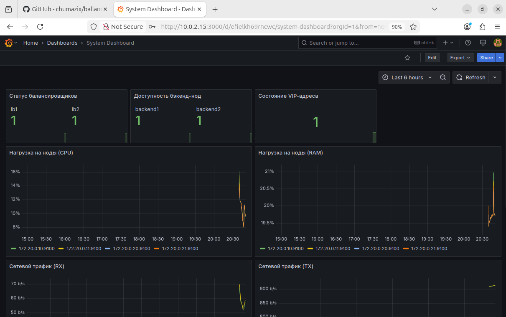

# Отказоустойчивая система с балансировкой и мониторингом

Проект реализует отказоустойчивую систему с балансировкой HTTP-трафика (Nginx + Keepalived), двумя бэкенд-серверами и централизованным мониторингом (VictoriaMetrics + Grafana). Вся установка и настройка автоматизирована через Ansible.

## Структура

- 7 Docker-контейнеров: `lb1`, `lb2`, `backend1`, `backend2`, `ansible`, `victoriametrics`, `grafana`.
- Изолированная сеть `backend-net` с подсетью `172.20.0.0/16`.
- VIP для балансировщиков: `172.20.0.100`.
- Сбор метрик: `node_exporter` (все узлы), `nginx-prometheus-exporter` (балансировщики).
- Визуализация: Grafana с предустановленным дашбордом.

## Требования

- Docker и Docker Compose
- Git

## Скриншоты



## Развёртывание

1. Клонируйте репозиторий:
```bash
git clone <url> && cd ballancer 
```

2. Выполните следующие команды по порядку:
```bash
docker exec -it ansible bash
cd /ansible

ansible-playbook -i /ansible/inventory/hosts.ini playbooks/playbook_backend.yml
ansible-playbook -i /ansible/inventory/hosts.ini playbooks/playbook_lb.yml
ansible-playbook -i /ansible/inventory/hosts.ini playbooks/playbook_exporters.yml
ansible-playbook -i /ansible/inventory/hosts.ini playbooks/playbook_cluster.yml
ansible-playbook -i /ansible/inventory/hosts.ini playbooks/playbook_monitoring.yml

exit
```

3. Дополнительная настройка для Вирутальных машин (Выполнять до шага 2):
```bash
# Отключить rp_filter
sudo sysctl -w net.ipv4.conf.all.rp_filter=0
sudo sysctl -w net.ipv4.conf.default.rp_filter=0

# Найти bridge-интерфейс сети backend-net
ip -4 addr show | grep -A 3 "br-"

# Найденый интерфейс из прошлой команды вставте вместо "br-..."
sudo ip route add 172.20.0.100/32 dev "br-..."
